# 🔬 Reproduction of ERA — *An AI System to Help Scientists Write Expert-Level Empirical Software*

A multi-stage reproduction (and small extension) of the official
[`google-research/era`](https://github.com/google-research/era) code for the Nature paper
*An AI system to help scientists write expert-level empirical software*.

This repo runs the official minimal demo, then asks the sharper research question —
**is ERA's tree search actually better than plain best-of-N sampling?** — and builds a credible,
multi-stage answer. It includes:

1. **Official minimal ERA demo** reproduction (California-Housing-style regression).
2. **ERA vs best-of-N** on that regression task.
3. **Repeated-run reliability** (mean ± std over repeats).
4. **A second benchmark — breast-cancer classification** (ERA also beats best-of-N, 3/3).
5. **Stage 3 — GIFT-Eval**: setting up the official time-series forecasting benchmark, wrapping it
   as an ERA-scorable task, connecting ERA's tree search to it, and an ERA-vs-best-of-N comparison.

> A `model_ablation.py` script (`gemini-2.5-flash-lite` vs `gemini-2.5-flash`) also exists but was
> not the main focus and is optional.

> 📄 The original ERA project README is preserved at **[`README_UPSTREAM.md`](README_UPSTREAM.md)**.

---

## 📑 Table of Contents

1. [Overview](#1-overview)
2. [Environment Setup](#2-environment-setup)
3. [Part 1 — Stage-1 Reproduction (official demo)](#3-part-1--stage-1-reproduction-official-demo)
4. [Part 2 — ERA Tree Search vs. Best-of-N](#4-part-2--era-tree-search-vs-best-of-n)
5. [Reliability — Repeated Runs](#5-reliability--repeated-runs)
6. [Stage 2 — Second Benchmark: Breast Cancer](#6-stage-2--second-benchmark-breast-cancer)
7. [Stage 3 — GIFT-Eval Time-Series Benchmark](#7-stage-3--gift-eval-time-series-benchmark)
8. [Stage 4 — scRNA-seq Batch Integration](#8-stage-4--scrna-seq-batch-integration)
9. [Final Takeaways](#9-final-takeaways)
10. [How to Run](#10-how-to-run)
11. [Repository Structure](#11-repository-structure)
12. [Security Note & Attribution](#12-security-note--attribution)

---

## 1. Overview

- **Task:** the official ERA demo `playground_s3e1.py` — a Kaggle / California-Housing-style **regression** problem.
- **Metric:** **negative RMSE** (`-RMSE`), so **higher (closer to 0) is better**.
- **The ERA loop:** an LLM writes/edits Python code → a sandbox executes it → it is auto-scored → **Flat UCB Tree Search (FUTS)** selects and iterates.

**What this reproduction adds on top of the demo:**

| Stage | Deliverable |
|------|-------------|
| Part 1 | Stage-1 reproduction report + search-progress figure |
| Part 2 | A *fair* ERA-vs-best-of-N comparison harness |
| Reliability | Repeated-run evaluation (mean ± std, CSV, plots) |
| Ablation | A small `flash-lite` vs `flash` model comparison (optional, `model_ablation.py`) |
| Stage 2 | Second benchmark — breast-cancer classification (ERA beats best-of-N 3/3) |
| Stage 3 | **GIFT-Eval** — official time-series benchmark setup, ERA-scorable wrapper, ERA integration, and ERA-vs-best-of-N |

---

## 2. Environment Setup

- **Python 3.12** (native arm64 / Apple Silicon via Homebrew).
- Packages: `pandas numpy scikit-learn google-genai matplotlib tabulate`.
- A Google **Gemini API key**.

```bash
pip install pandas numpy scikit-learn google-genai matplotlib tabulate

# Use the Gemini key (avoid the SDK preferring GOOGLE_API_KEY):
unset GOOGLE_API_KEY
export GEMINI_API_KEY="your_key"

# Optional model override (scripts default to gemini-2.5-flash-lite):
export GEMINI_MODEL=gemini-2.5-flash-lite
```

> ⚠️ **Security:** the local `implementation/sandbox.py` is **NOT a secure sandbox** — it runs
> LLM-generated code directly on your machine with no isolation. Use it **only** for this trusted
> toy reproduction; use Docker / firejail / a VM for anything real.

---

## 3. Part 1 — Stage-1 Reproduction (official demo)

Confirms the full ERA loop runs and **self-improves** on the official demo. (This is the official
*minimal demo*, **not** the full scRNA-seq / COVID experiment from the paper.)

**Key results**

| Stage | Best score (neg RMSE, higher is better) |
|-------|------------------------------------------|
| Initial baseline | **−0.7339** |
| 10-iteration best | ≈ **−0.5785** |
| 30-iteration best | **−0.5776** |

**Search progress**

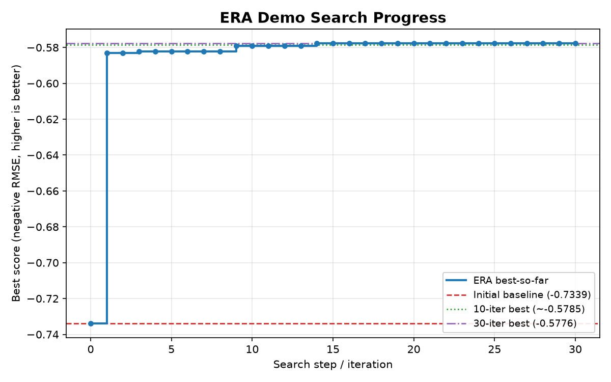

**Interpretation:** the search jumps off the linear-regression baseline immediately at step 1, then
makes small steady gains on gradient-boosting + feature-engineering solutions and **quickly plateaus**
— 30 iterations barely beat 10, indicating a small toy-task search space.

📎 Full report: [`implementation/saved_runs/playground_s3e1_iter30/report.pdf`](implementation/saved_runs/playground_s3e1_iter30/report.pdf)

---

## 4. Part 2 — ERA Tree Search vs. Best-of-N

**Question:** is ERA more than best-of-N sampling? Both methods get an **equal budget of N = 20 LLM
calls**, the **same** train/val split, the **same** initial baseline, and the **same** scorer.
The only difference: **ERA** conditions each new candidate on a *tree-selected parent*, while
**best-of-N** samples independently from the *same fixed initial prompt* every time.

**Result (single run, `gemini-2.5-flash-lite`)**

| Method | Final best score (neg RMSE) |
|--------|------------------------------|
| Initial baseline | −0.7339 |
| **ERA tree search** | **−0.5735** ✅ |
| Best-of-N sampling | −0.6149 |
| **Winner** | **ERA** |

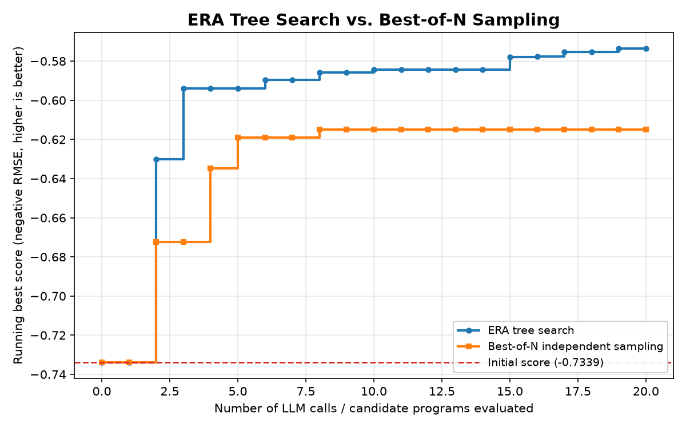

**Two findings:**
1. **Higher final score** — ERA keeps climbing while best-of-N flatlines after ~5 calls.
2. **More reliable** — ERA produced only **3 / 20 invalid** candidates vs best-of-N's **13 / 20**,
   because ERA edits already-working parent code instead of rewriting complex models from scratch
   off the weak linear baseline.

**Caveat:** this is a *single stochastic run* on a toy task — confirmed/strengthened by the repeated
runs below.

📎 Full report: [`implementation/saved_runs/era_vs_bon/report.pdf`](implementation/saved_runs/era_vs_bon/report.pdf)

---

## 5. Reliability — Repeated Runs

To turn a suggestive single run into a defensible result:

- **`repeat_era_vs_bon.py`** — repeats the fair comparison `num_repeats` times and writes:
  `results.json` (per-repeat records), `summary.csv`, `repeated_curves.{png,pdf}`,
  `final_best_scores.{png,pdf}`, and a Chinese `summary.md`.
  Supports `--model`, `--N`, `--num_repeats`, and `--plot-only` (regenerate plots with **zero** API calls).
- **`model_ablation.py`** — compares `gemini-2.5-flash-lite` vs `gemini-2.5-flash` (N = 10, 1 repeat)
  and writes `results.json`, `model_ablation.{png,pdf}`, and a Chinese `summary.md`.
  *Gemini Pro is intentionally never the default.*

### Repeated-run result (`gemini-2.5-flash-lite`, N = 10, 3 repeats)

**ERA won all 3 repeats** — the single-run advantage holds up.

| Repeat | ERA final | Best-of-N final | Winner |
|:------:|:---------:|:---------------:|:------:|
| 0 | −0.5810 | −0.6017 | **ERA** |
| 1 | −0.5910 | −0.6084 | **ERA** |
| 2 | −0.5750 | −0.6071 | **ERA** |
| **Average** | **−0.5823** | **−0.6058** | **ERA (3/3)** |

- **Average gap:** ERA is **+0.0234** higher (neg RMSE) than best-of-N.
- **Failed candidates:** ERA **6/30 (20%)** vs best-of-N **10/30 (33%)** — best-of-N fails more, consistent with the single-run finding.

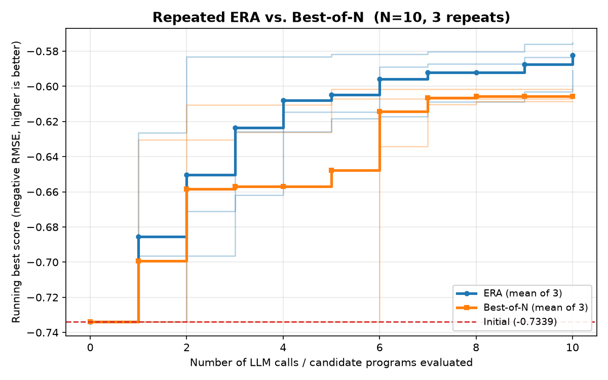
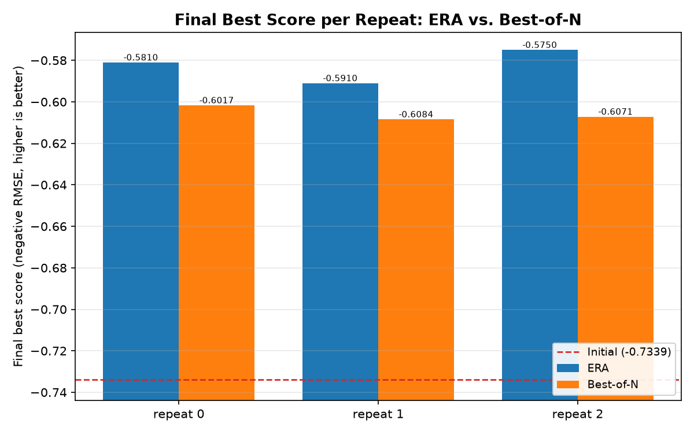

> The `model_ablation.py` outputs appear under `implementation/saved_runs/model_ablation/` once you run it.
> Full Chinese write-up: [`implementation/saved_runs/repeated_era_vs_bon/summary.md`](implementation/saved_runs/repeated_era_vs_bon/summary.md).

### Phase-3 Summary (中文 / 给导师)

### 已完成的工作
- **成功复现官方 ERA 最小 Demo**：打通 LLM 生成/改写代码 → 本地沙箱执行 → 自动打分（负 RMSE）→ 树搜索迭代 的完整闭环。
- **绘制搜索进度图**：初始 `-0.7339`，10 次迭代约 `-0.5785`，30 次迭代 `-0.5776`。
- **实现 ERA vs best-of-N 对照实验**（相同预算 N=20，`flash-lite`）：ERA 最终 `-0.5735`、best-of-N 最终 `-0.6149`，**ERA 获胜**；且 ERA 仅 3/20 个失败候选，best-of-N 有 13/20 个，**ERA 明显更稳定**。
- **运行了重复评估实验**（`flash-lite`，N=10，3 次）：**ERA 3/3 全胜**，平均 `-0.5823` vs best-of-N `-0.6058`；失败率 20% vs 33%。

### 当前结论
- ERA 的核心闭环已被验证，系统能稳定运行并自我改进。
- 玩具任务**很快进入平台期**（10→30 次迭代提升极小），绝对差距有限。
- **ERA 稳定优于 best-of-N**：重复 3 次中 ERA 全胜（3/3），平均分数更高、失败更少，说明该优势不是单次运行的偶然；玩具任务绝对差距有限，后续可增大 N / 重复次数进一步确认。

### 模型建议
- **继续用 `gemini-2.5-flash-lite`** 做便宜的重复实验（脚本默认）。
- **用 `gemini-2.5-flash` 做一次小型消融**，更强模型可能写出更好的代码、减少失败。
- **暂不使用 `gemini-2.5-pro`**：成本过高，仅在任务明显变难或便宜模型频繁失败时再考虑。

### 下一步
从官方玩具 Demo 迁移到更难的小型基准，建议顺序：
1. 另一个 **Kaggle Playground** 风格任务 → 2. **GIFT-Eval** 小子集 → 3. **scRNA 20k-cell** 搜索设置 → 4. 之后再做论文级别的更大任务。

📎 Standalone copy: [`implementation/saved_runs/phase3_summary.md`](implementation/saved_runs/phase3_summary.md)

---

## 6. Stage 2 — Second Benchmark: Breast Cancer

To test whether ERA **generalizes beyond the original regression demo**, Stage 2 adds a second,
*different* task: **`sklearn` breast-cancer binary classification** (`playground_breast_cancer.py`).
It is fully self-contained (`sklearn.datasets.load_breast_cancer`, **no download**). Metric:
**ROC-AUC** (higher is better). Baseline: a deliberately weak `DecisionTreeClassifier(max_depth=1)`.

### Part 1 — the benchmark runs and ERA improves it
| | ROC-AUC |
|---|---|
| Initial baseline (depth-1 stump) | 0.8468 |
| **ERA best (10 iterations)** | **0.9886** |

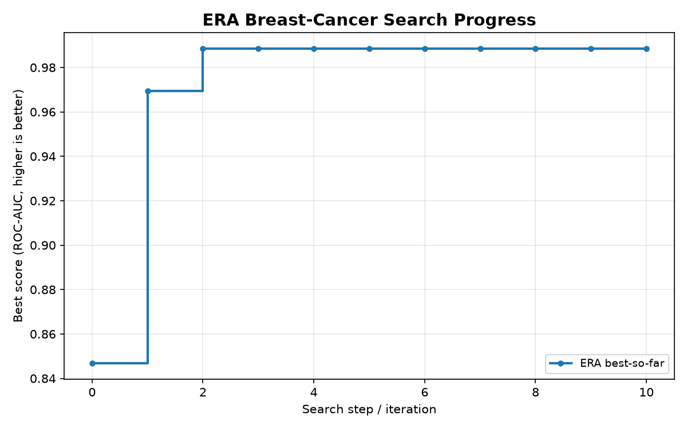

ERA lifted a weak ~0.85 baseline to ~0.99 — the loop **generalizes to a classification task**.

### Part 2 — ERA vs. Best-of-N on breast cancer
Same fairness contract as Stage 1 (same split / baseline / scorer / model / equal budget), reusing the
verified task-agnostic search/sampling core. Run with `gemini-2.5-flash` (matching the Part-1 run).

**Single run (N = 10):**
| | ROC-AUC |
|---|---|
| Initial baseline | 0.8468 |
| **ERA** | **0.9943** ✅ |
| Best-of-N | 0.9841 |
| Invalid candidates | ERA 0/10, Best-of-N 0/10 |

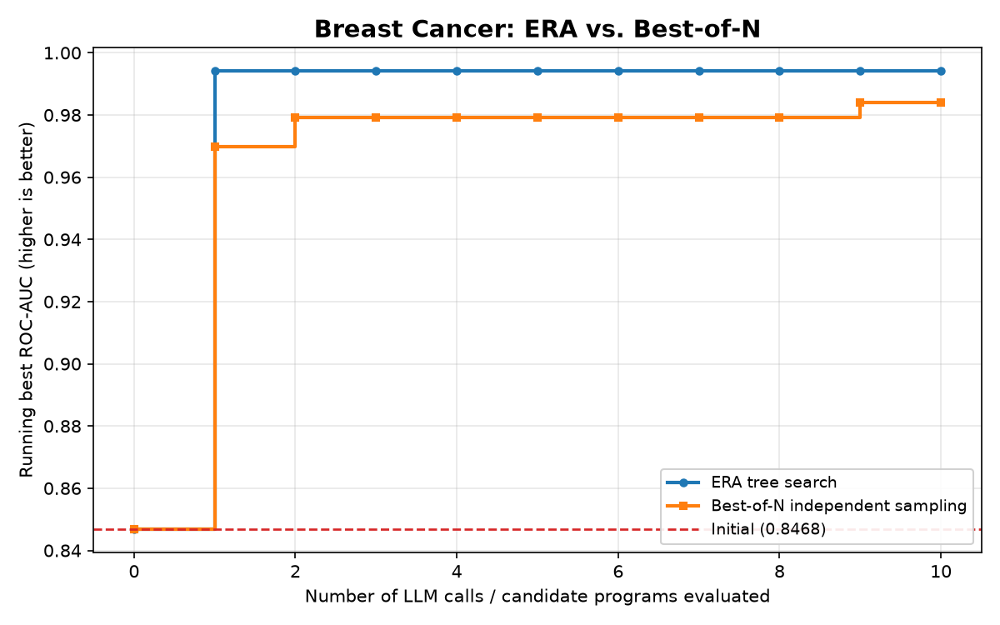

**Repeated (N = 10 × 3 repeats): ERA won 3/3.**
| | ERA | Best-of-N |
|---|:---:|:---:|
| Avg final ROC-AUC | **0.9888** | 0.9808 |
| Wins | **3 / 3** | 0 / 3 |
| Invalid candidates | 0 / 30 | 0 / 30 |

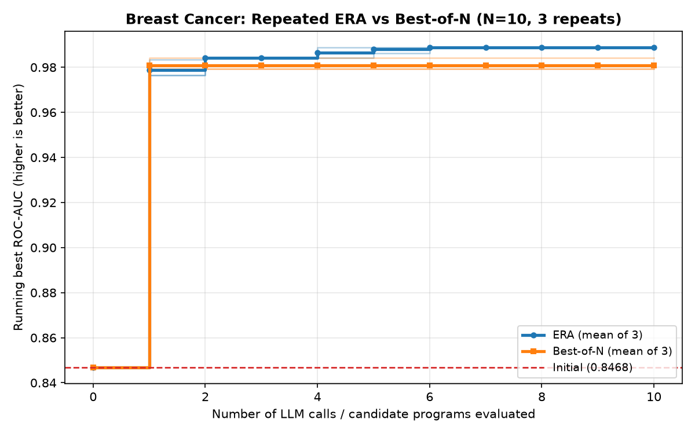
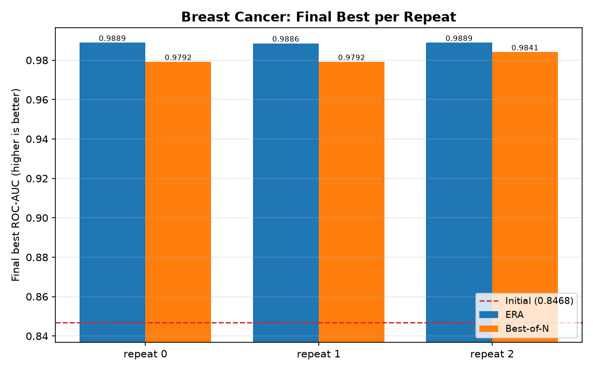

**Takeaway:** ERA beats best-of-N on the *second* benchmark too, and consistently (**3/3**). The margin
is small (~0.008 AUC) because breast cancer is an easy task where best-of-N also reaches ~0.98 — but ERA
is reliably higher. With `gemini-2.5-flash`, **zero** candidates failed, confirming the Part-1 prompt fix
(no more `target`-column `KeyError`s). This supports that ERA's tree-search advantage **generalizes
beyond the first task**.

---

## 7. Stage 3 — GIFT-Eval Time-Series Benchmark

Stage 3 takes ERA beyond the toy tabular tasks onto a **real public benchmark**:
[**GIFT-Eval**](https://github.com/SalesforceAIResearch/gift-eval) (Salesforce), a general
time-series forecasting benchmark. It proceeds in four sub-stages: **C1** stand up the official
benchmark, **C2** wrap one small task as an ERA-scorable reward, **C3** run ERA tree search on it,
and **C4** compare ERA vs best-of-N.

### ⚙️ Two-environment architecture (important — please read)

ERA and GIFT-Eval require **incompatible** Python environments (ERA uses `numpy 2.x` + `google-genai`;
GIFT-Eval pins `gluonts 0.15.1` + `numpy 1.26`). They therefore run in **two separate environments**,
bridged by `subprocess`:

1. **ERA-side orchestration** runs from `/Users/zhangweikun/era/implementation` using the **normal ERA
   environment** (plain `python`). The scripts `gift_eval_era_search.py` (C3) and
   `gift_eval_compare_era_vs_bon.py` (C4) are **controllers** — they generate candidates with Gemini
   and drive FUTS, but **never import any GIFT-Eval / gluonts package**.
2. **GIFT-Eval scoring** runs inside the **isolated GIFT-Eval venv**
   `/Users/zhangweikun/era/gift-eval/.venv/bin/python`. The controller scores every candidate by
   launching the C2 scorer as a subprocess, e.g.:

   ```bash
   /Users/zhangweikun/era/gift-eval/.venv/bin/python -u gift_eval_m4_weekly_task.py \
       --candidates /path/to/candidate.py
   ```

So launching `python gift_eval_compare_era_vs_bon.py ...` from the ERA folder is correct: that script
is only the controller, and the **actual GIFT-Eval metric computation happens inside the GIFT-Eval
venv**, not the ERA environment.

> 🧪 **Run in a normal terminal, not inside an agent sandbox.** GIFT-Eval's native libraries
> (`statsforecast` / `numba`) **segfault** under the sandbox's syscall restrictions (exit 139, before
> any output). Running in a normal terminal with the GIFT-Eval venv works perfectly. The whole
> `/Users/zhangweikun/era/gift-eval/` clone (its own repo + venv + downloaded data) is **gitignored**.

### C1 — Official GIFT-Eval setup and smoke test

- GIFT-Eval repo cloned to `/Users/zhangweikun/era/gift-eval`, with an isolated venv at
  `/Users/zhangweikun/era/gift-eval/.venv`.
- Dataset / config: **`m4_weekly` → `m4_weekly/W/short`** — **359 univariate weekly series**,
  **prediction length 13**, **windows = 1**. Only this small dataset (~1.5 MB) was downloaded — **not**
  the full benchmark.
- The official **Naive** baseline ran end-to-end and **matched the official `naive.ipynb` output**:

  | Metric | Value |
  |---|---|
  | MSE[mean] | 453525.1459 |
  | MASE | 2.7773 |
  | RMSE | 673.44 |
  | CRPS | 0.0609 |

- Outputs: [`implementation/saved_runs/gift_eval_c1_setup/`](implementation/saved_runs/gift_eval_c1_setup/).

**C1 proves the official GIFT-Eval evaluation pipeline works locally.**

### C2 — ERA-scorable GIFT-Eval wrapper

- Wrapper: `implementation/gift_eval_m4_weekly_task.py` →
  outputs in [`implementation/saved_runs/gift_eval_c2_task_wrapper/`](implementation/saved_runs/gift_eval_c2_task_wrapper/).
- Candidate interface (what ERA generates):

  ```python
  def forecast(context, prediction_length, freq, metadata=None):
      ...
  ```

  - `context` — a 1D numpy array of **past target values only**.
  - `prediction_length` — the forecast horizon (13 here).
  - `freq` — the frequency string, e.g. `"W"`.
  - The candidate must return a 1D numpy array of length **exactly `prediction_length`**.
  - **No future labels are exposed** (gluonts passes only the input window).
  - The point forecast is adapted into the official **GluonTS** evaluation pipeline.
  - **Reward = `-MASE`**, because GIFT-Eval metrics are lower-is-better but ERA assumes higher-is-better.

- Baseline candidate results on `m4_weekly/W/short`:

  | Candidate | Valid | MASE | CRPS | RMSE | Reward |
  |---|---|---:|---:|---:|---:|
  | naive | yes | 2.777295 | 0.063399 | 673.4428 | -2.777295 |
  | seasonal naive | yes | 9.577987 | 0.132493 | 1397.8209 | -9.577987 |
  | moving average | yes | 3.420637 | 0.078397 | 802.6817 | -3.420637 |

  - The **naive candidate matches the C1 official Naive** for the point metrics (MASE/RMSE).
  - **CRPS differs slightly** because the wrapper adapts a point forecast into *degenerate* quantiles;
    since the **reward uses MASE**, this is acceptable.
  - **Invalid-candidate handling was tested**: crashes, wrong shapes, NaN/inf, and a missing `forecast`
    all return `valid=false` and `reward=-inf`.

### C3 — Connecting ERA to GIFT-Eval

- Script: `implementation/gift_eval_era_search.py` — connects Gemini/FUTS candidate generation to the
  C2 GIFT-Eval scorer (via the subprocess bridge above).
- Runs: [`gift_eval_c3_era_smoke/`](implementation/saved_runs/gift_eval_c3_era_smoke/),
  [`gift_eval_c3_era_iter10_conservative/`](implementation/saved_runs/gift_eval_c3_era_iter10_conservative/),
  [`gift_eval_c3_era_iter20_conservative/`](implementation/saved_runs/gift_eval_c3_era_iter20_conservative/),
  consolidated in [`gift_eval_c3_summary/`](implementation/saved_runs/gift_eval_c3_summary/).

**5-iteration smoke test** — the engineering pipeline succeeded, ERA generated candidates, the
subprocess bridge to the GIFT-Eval venv worked, and invalid handling worked. The best candidate
remained the naive baseline.

**10-iteration conservative run** — prompt `conservative_v2`; initial MASE `2.7772950477470046`;
best MASE `2.7772950477470046`; valid/invalid **11/0** (incl. naive seed). Generated candidates
approached naive very closely but did not beat it.

**20-iteration conservative run** — prompt `conservative_v2`; initial MASE `2.7772950477470046`;
best MASE `2.7772950477470046`; valid/invalid **21/0** (incl. naive seed); closest generated
candidate ≈ MASE `2.7772955883` — extremely close but still slightly worse than naive.

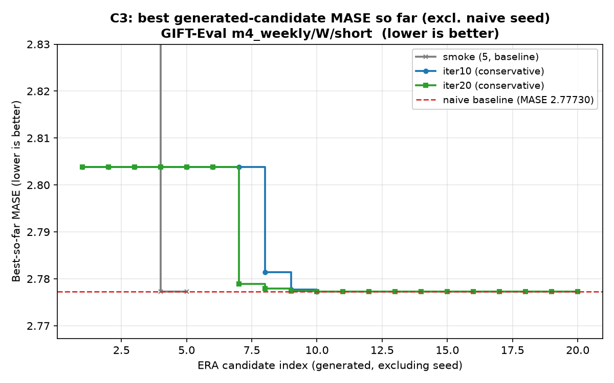

**Interpretation:**
- C3 engineering succeeded; ERA was successfully connected to a real GIFT-Eval benchmark.
- The conservative prompt made candidates **valid and stable** (0 invalid in the 10- and 20-iter runs).
- `m4_weekly/W/short` has a **very strong last-value naive baseline**.
- **ERA did not beat naive** under the tested small budgets. *(We do not claim ERA beat GIFT-Eval naive.)*

### C4 — GIFT-Eval ERA vs best-of-N

- Script: `implementation/gift_eval_compare_era_vs_bon.py`.
- Settings: dataset `m4_weekly/W/short`; model `gemini-2.5-flash`; prompt `conservative_v2`;
  reward `-MASE`; shared seed = last-value naive baseline. Both methods spend an **equal budget**
  (N Gemini calls each); the only difference is **tree-selected parent (ERA)** vs **always-the-seed
  (best-of-N)**.

**N = 10** — [`gift_eval_c4_era_vs_bon_N10/`](implementation/saved_runs/gift_eval_c4_era_vs_bon_N10/)

| | MASE |
|---|---:|
| naive baseline | 2.77729505 |
| ERA — best **incl.** seed | 2.77729505 |
| ERA — best **generated** (excl. seed) | **2.77729505** |
| best-of-N — best incl. seed | 2.77729505 |
| best-of-N — best **generated** (excl. seed) | 2.79541584 |
| ERA valid/invalid | 10 / 0 |
| best-of-N valid/invalid | 10 / 0 |
| **Winner (lower best generated MASE)** | **ERA** |
| Either beat naive? | **no** |

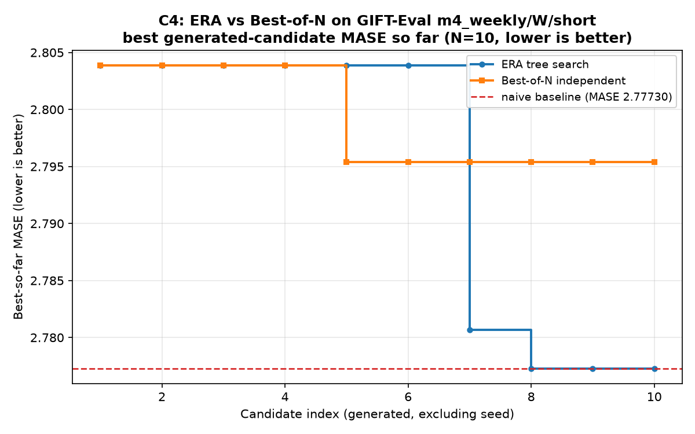

**N = 20** — [`gift_eval_c4_era_vs_bon_N20/`](implementation/saved_runs/gift_eval_c4_era_vs_bon_N20/)

| | MASE |
|---|---:|
| naive baseline | 2.77729505 |
| ERA — best **incl.** seed | 2.77729505 |
| ERA — best **generated** (excl. seed) | **2.77729505** |
| best-of-N — best incl. seed | 2.77729505 |
| best-of-N — best **generated** (excl. seed) | 2.78183119 |
| ERA valid/invalid | 19 / 1 |
| best-of-N valid/invalid | 20 / 0 |
| **Winner (lower best generated MASE)** | **ERA** |
| Either beat naive? | **no** |

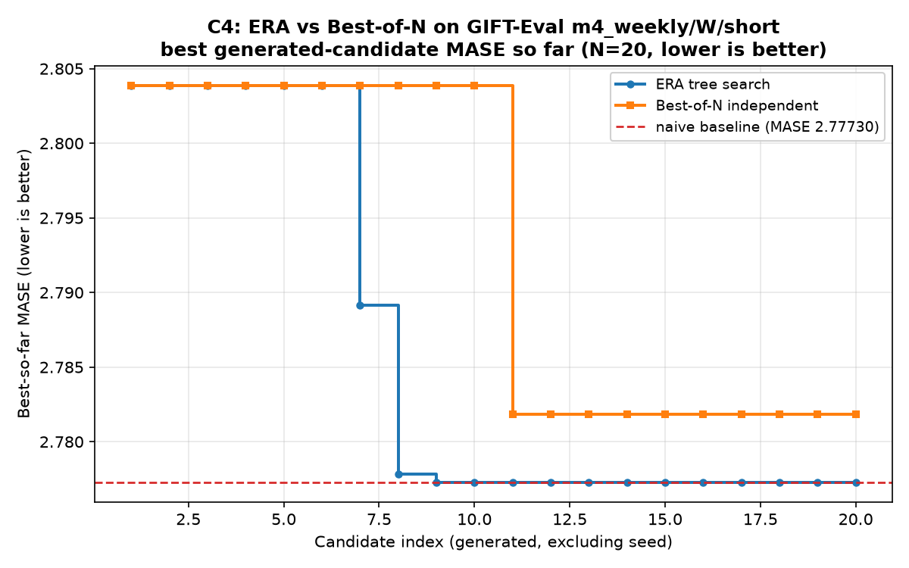

**Interpretation:**
- **ERA did not beat the strong naive baseline.**
- But under **equal LLM budgets, ERA consistently produced better generated candidates than
  independent best-of-N** — ERA's best generated candidate reached naive exactly (distance 0), while
  best-of-N stayed measurably above it (≈ 2.7954 at N=10, ≈ 2.7818 at N=20).
- This preserves the project's central mechanism finding: **tree-search refinement can outperform
  independent sampling**, even on a harder real benchmark where the original baseline is hard to beat.

### C5–C6 — A subset where ERA actually beats naive: `m4_hourly/H/short`

Because naive is near-optimal on `m4_weekly`, a **subset-scouting** pass (C5) looked for a GIFT-Eval
config where naive is *weak*. It found **`m4_hourly/H/short`** (hourly, horizon 48): naive MASE
≈ **11.61**, but a seasonal-naive forecast with daily period 24 scores ≈ **1.19** (~10× better). C6A
then made the scorer + ERA scripts **dataset-parametric** (`--dataset/--freq/--term`, and an explicit
`--initial_seed {naive,seasonal_naive}` defaulting to **naive**). C6B ran ERA there **from the weak
naive seed**:

| run | result |
|---|---|
| ERA-only (10 iter, naive seed) | naive **11.6077** → **ERA best MASE 1.1384** (11/0 valid) |
| ERA vs best-of-N (N=10, naive seed) | **ERA 1.1932** vs best-of-N **1.3651** → **ERA wins**; both beat naive |
| ERA vs best-of-N (N=20, naive seed) | **ERA 1.1932** vs best-of-N **1.3651** → **ERA wins** again (both 20/0 valid; ERA explored 11 distinct solutions vs 6) |

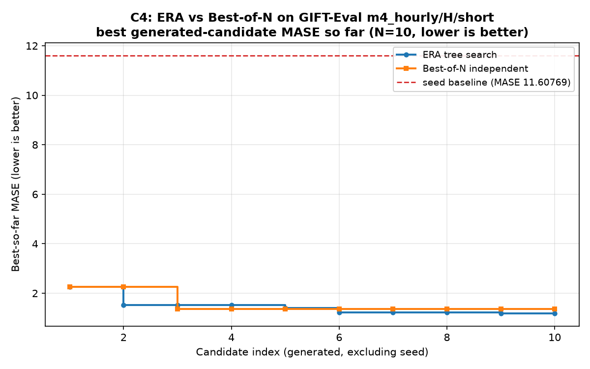

**What ERA learned:** starting from last-value naive, ERA **discovered daily seasonality (period
24)**. Its best program tiles the last 24 hours (seasonal naive) and adds a small *damped
seasonal-difference* correction — beating even the seasonal-naive reference (1.1932 → **1.1384**).
ERA's tree search refined a chain `11.61 → 2.25 → 1.51 → 1.40 → 1.22 → 1.19`, whereas best-of-N
sampled independently and plateaued at 1.3651 (a noisier season-averaging approach).

**Why it matters:** unlike `m4_weekly` (naive near-optimal, ERA could only tie), `m4_hourly` has
*discoverable* structure — so ERA **clears the naive baseline by ~10×** and again beats best-of-N.
This is the first GIFT-Eval subset confirming ERA's advantage in **absolute** terms, not just as a
process comparison.

---

## 8. Stage 4 — scRNA-seq Batch Integration

The fourth stage takes ERA to the upstream **single-cell RNA-seq batch integration** task
([`implementation/notebooks/single_cell_batch_integration.ipynb`](implementation/notebooks/single_cell_batch_integration.ipynb)).
Candidates implement `eliminate_batch_effect_fn(adata, config)` returning a batch-corrected embedding
in `obsm['X_emb']` (raw counts in, 2000 highly-variable genes, **must not use `cell_type`**). The paper
scores this with the mean of 12 `scib` metrics on a 20,000-cell subsample, which needs R/`kBET` and the
private ~3 GB Kaggle dataset — **both deferred**. Instead we reuse the same **two-environment
architecture** as GIFT-Eval (controller in the ERA env; every candidate scored by subprocess into an
isolated `scRNA-env` with `scanpy`/`anndata`/numpy < 2, never importing scanpy into the ERA env) and
score with a **reduced Python-only proxy** — `reward = bio_score + batch_mixing_score`, higher is
better (cell types stay separable while batches mix). **This proxy is a bridge, not the official scIB
metric.** Two data regimes were run: a **synthetic** AnnData (D1–D2A) and a **real public bridge** —
10x **PBMC3k** biology with a *controlled artificial batch* injected into the counts (D3A–D3C).

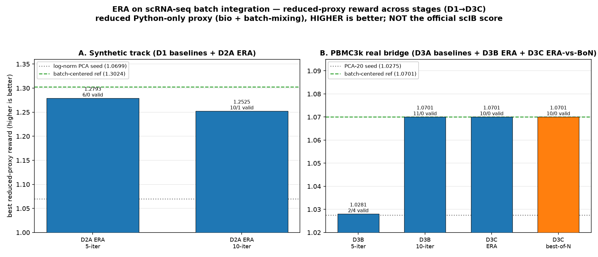

| run | seed → best (reduced-proxy reward) | valid/invalid | note |
|---|---|---|---|
| D2A ERA — synthetic, 5-iter | 1.0699 → **1.2793** | 6/0 | lifts toward the batch-centered ref (1.3024) |
| D2A ERA — synthetic, 10-iter | 1.0699 → **1.2525** | 10/1 | same direction, one invalid candidate |
| D3B ERA — PBMC3k, 5-iter (pre-hardening) | 1.0275 → 1.0281 | 2/4 | stalled on broken-ComBat / `n_jobs=-1` crashes |
| **D3B ERA — PBMC3k, 10-iter (hardened)** | 1.0275 → **1.0701** | **11/0** | reaches the batch-centered reference |
| **D3C ERA vs best-of-N — PBMC3k, N=10** | both → **1.0700699** (tie) | 10/0 each | ERA 1.0700699151 vs BoN 1.0700699166 (~1.4e-9) |

**What ERA learned.** On PBMC3k, ERA's best program (D3B, candidate 1) is exactly **normalize-total →
log1p → PCA(20) → subtract each batch's mean vector in the embedding space** — it independently
**rediscovered the hand-written batch-centered-PCA reference**, matching its score (≈ 1.070070) to full
precision. The hardened `pbmc3k_conservative_v2` prompt (which bans the broken ComBat/external APIs and
points at reliable numpy/sklearn/scanpy blocks) took invalids from **4/6 → 0/11** between the 5-iter
smoke and the 10-iter run.

**ERA vs best-of-N is a tie here.** Under equal budget (N=10 each,
[`implementation/scrna_compare_era_vs_bon.py`](implementation/scrna_compare_era_vs_bon.py)), both methods
were 10/10 valid and both reached the reference: ERA **1.0700699151** vs best-of-N **1.0700699166**. The
script names best-of-N the "winner", but only by **~1.4e-9** — the two best candidates are the *same*
method; the gap is a pure `float32` (ERA) vs `float64` (BoN) rounding difference in the two candidate
programs. 7 of 10 best-of-N draws independently found the same correction.

**Why it's a tie (and that's expected).** Unlike GIFT-Eval `m4_hourly`, where the winning structure was
*deep* (period-24 seasonality) and ERA's tree search paid off, here the reduced-proxy optimum for simple
heuristics *is* batch-centered PCA and it sits **one hop from the PCA seed** — trivially discoverable, so
tree search and independent sampling both reach it reliably. This mirrors the `m4_weekly` pattern
(near-optimal seed → ERA ties, never loses). The consolidated figure above is regenerated from the saved
`results.json` files by [`implementation/scrna_plot_summary.py`](implementation/scrna_plot_summary.py)
(no Gemini); per-run outputs live under `saved_runs/scrna_d3b_*` and `saved_runs/scrna_d3c_*`.

> **Deferred (the real paper benchmark):** the official Kaggle dataset, R/`kBET`, and the 12-metric scIB
> score on 20k cells. PBMC3k + the reduced proxy is a lightweight bridge that validates the full
> ERA → scorer → FUTS loop on *real* single-cell data end-to-end.

---

## 9. Final Takeaways

This project is **not** a full reproduction of the Nature paper's full-scale experiments (e.g.
scRNA-seq, COVID forecasting, the full GIFT-Eval benchmark, geospatial segmentation, or ZAPBench).

Instead, it is a **mechanistic reproduction and extension** showing:

1. The official ERA loop runs locally and **improves code** on the official toy regression demo.
2. ERA **outperforms best-of-N** on the California-Housing-style regression task.
3. ERA **wins repeated-run comparisons** on that task (3/3).
4. ERA **generalizes** to a second toy benchmark — breast-cancer classification.
5. ERA also **beats best-of-N on breast cancer** (3/3).
6. **GIFT-Eval** was successfully set up and **wrapped as an ERA-scorable task**.
7. ERA was successfully **connected to GIFT-Eval** via a subprocess bridge to an isolated venv.
8. On `m4_weekly/W/short`, **naive last-value forecasting is extremely strong; ERA did not beat it**,
   but ERA still produced **better generated candidates than independent best-of-N** under N=10 and N=20.
9. On a harder/seasonal subset (`m4_hourly/H/short`), **ERA does beat naive**: starting from the weak
   naive seed it **discovered daily seasonality (period 24)**, reaching MASE **1.1384** (vs naive
   **11.61**, and below the seasonal-naive reference 1.1932), and again **beat best-of-N**
   (1.1932 vs 1.3651). This is the project's main *positive* GIFT-Eval result.
10. **Stage 4 (scRNA-seq)** wired the same two-environment ERA loop onto *real* single-cell data (a
    PBMC3k bridge with a reduced proxy score). ERA **independently rediscovered batch-centered PCA**
    (PCA-20 seed 1.0275 → 1.0701, 11/11 valid after prompt hardening), and ERA vs best-of-N was an
    **effective tie** (both 10/0 valid, both reached the reference; ~1.4e-9 apart) — expected, since
    the proxy optimum sits one hop from the seed. Official scIB scoring remains deferred.

### Limitations
- The local `implementation/sandbox.py` is **not a secure sandbox** (runs LLM code directly).
- GIFT-Eval scoring ran in a **local terminal + isolated venv**, **not** a secure sandbox.
- Only **`m4_weekly/W/short`** was tested; the **full GIFT-Eval benchmark was not run**.
- **No foundation-model forecasting baselines** (Moirai/Chronos/etc.) were run.
- The candidate interface currently uses **simplified point forecasts** (degenerate quantiles for CRPS).
- **scRNA-seq is only a reduced-proxy PBMC3k bridge** (Stage 4) — the **official 12-metric scIB score,
  R/`kBET`, and the real Kaggle dataset are deferred**. **No COVID / geospatial / ZAPBench** yet.
- The **API budget was small** (results are consistent, not tight statistical claims).

---

## 10. How to Run

```bash
cd implementation

unset GOOGLE_API_KEY
export GEMINI_API_KEY="your_key"

# 1) Official ERA demo (produces results/futs_progress.json)
python playground_s3e1.py

# 2) ERA vs best-of-N — single comparison (N=20 → 40 Gemini calls)
python compare_era_vs_bon.py --n 20

# 3) Repeated reliability run (N=10, 3 repeats → 60 calls)
python repeat_era_vs_bon.py --model gemini-2.5-flash-lite --N 10 --num_repeats 3

# 4) Model ablation: flash-lite vs flash (N=10, 1 repeat each → 40 calls)
python model_ablation.py

# --- Stage 2: breast-cancer benchmark ---
# 5) Breast-cancer demo (initial ~0.8468 -> ERA best ~0.99)
python playground_breast_cancer.py

# 6) Breast-cancer ERA vs best-of-N — single (N=10 → 20 calls)
python compare_era_vs_bon_breast_cancer.py --n 10

# 7) Breast-cancer repeated (N=10, 3 repeats → 60 calls)
python repeated_breast_cancer_era_vs_bon.py --n 10 --num_repeats 3
```

### Stage 3 — GIFT-Eval (two environments)

The C1/C2 **scoring** steps must run with the **GIFT-Eval venv**. The C3/C4 scripts are **launched
from the ERA environment** (plain `python`) but **call the GIFT-Eval venv internally** for scoring.

```bash
cd /Users/zhangweikun/era/implementation

# --- C1 / C2: scoring MUST use the GIFT-Eval venv ---
# C1 official Naive smoke test (run from the gift-eval clone):
/Users/zhangweikun/era/gift-eval/.venv/bin/python -u \
    /Users/zhangweikun/era/gift-eval/run_naive_smoke.py
# C2 score candidate forecasting programs with the official gluonts pipeline:
/Users/zhangweikun/era/gift-eval/.venv/bin/python -u gift_eval_m4_weekly_task.py

# --- C3: ERA search CONTROLLER (ERA env) — it calls the GIFT-Eval venv scorer internally ---
unset GOOGLE_API_KEY
export GEMINI_API_KEY="your_key"
export GEMINI_MODEL=gemini-2.5-flash

python gift_eval_era_search.py \
    --iterations 20 \
    --model gemini-2.5-flash \
    --out_dir saved_runs/gift_eval_c3_era_iter20_conservative

# --- C4: ERA vs best-of-N on GIFT-Eval (ERA env controller; GIFT-Eval venv scoring internally) ---
python gift_eval_compare_era_vs_bon.py \
    --N 20 \
    --model gemini-2.5-flash \
    --out_dir saved_runs/gift_eval_c4_era_vs_bon_N20
```

> 🔌 **Why this is correct:** `gift_eval_era_search.py` and `gift_eval_compare_era_vs_bon.py` are
> *controllers* in the ERA environment. They never import gluonts; for every candidate they
> `subprocess` out to `/Users/zhangweikun/era/gift-eval/.venv/bin/python gift_eval_m4_weekly_task.py`,
> so the GIFT-Eval metric is always computed inside the isolated GIFT-Eval venv. Run these in a normal
> terminal (the GIFT-Eval native libs segfault under an agent sandbox).

> 💡 Cost scales as **2 × N × repeats** Gemini calls per comparison run. Keep `N` small. (C3 spends
> `--iterations` calls; C4 spends `2 × N`.)

---

## 11. Repository Structure

```
implementation/
├── playground_s3e1.py                    # Stage-1 official ERA demo (regression)
├── playground_breast_cancer.py           # Stage-2 benchmark (breast-cancer classification)
├── futs.py                               # Flat UCB Tree Search (FUTS) — unchanged
├── llm.py                                # Gemini wrapper: retries + GEMINI_MODEL override
├── sandbox.py                            # local executor (INSECURE — toy only)
├── compare_era_vs_bon.py                 # Stage-1 ERA vs best-of-N (single)
├── repeat_era_vs_bon.py                  # Stage-1 repeated comparison
├── model_ablation.py                     # flash-lite vs flash ablation
├── compare_era_vs_bon_breast_cancer.py   # Stage-2 ERA vs best-of-N (single)
├── repeated_breast_cancer_era_vs_bon.py  # Stage-2 repeated comparison
├── plot_progress.py                      # robust progress-figure plotter
├── gift_eval_m4_weekly_task.py           # Stage-3 C2: original (m4_weekly) ERA-scorable wrapper
├── gift_eval_task.py                     # Stage-3 C6A: generalized scorer (--dataset/--freq/--term)
├── gift_eval_subset_scout.py             # Stage-3 C5: cheap-baseline subset scouting
├── gift_eval_era_search.py               # Stage-3 C3/C6: ERA/FUTS controller (ERA env; subprocess scoring)
├── gift_eval_compare_era_vs_bon.py       # Stage-3 C4/C6: ERA vs best-of-N on GIFT-Eval
├── initial_candidate_conservative.py     # optional conservative seed candidate (Stage-3)
├── scrna_synthetic_smoke.py              # Stage-4 D1: synthetic scRNA smoke (reduced proxy)
├── scrna_synthetic_task.py               # Stage-4 D2A: synthetic scorer (scRNA-env)
├── scrna_realdata_smoke.py               # Stage-4 D3A: real-data smoke (--source scanpy_pbmc3k)
├── scrna_realdata_task.py                # Stage-4 D3B: PBMC3k scorer (scRNA-env)
├── scrna_era_search.py                   # Stage-4 D2A/D3B: ERA/FUTS controller (ERA env; subprocess scoring)
├── scrna_compare_era_vs_bon.py           # Stage-4 D3C: ERA vs best-of-N on PBMC3k
├── scrna_plot_summary.py                 # Stage-4: consolidated scRNA figure (reads results.json)
└── saved_runs/
    ├── playground_s3e1_iter30/              # Stage-1 Part-1 report + figures
    ├── era_vs_bon/                          # Stage-1 Part-2 report + figures
    ├── repeated_era_vs_bon/                 # Stage-1 repeated results
    ├── breast_cancer_era/                   # Stage-2 demo: progress + best code/score
    ├── breast_cancer_era_vs_bon/            # (generated by Stage-2 single comparison)
    ├── repeated_breast_cancer_era_vs_bon/   # (generated by Stage-2 repeated comparison)
    ├── model_ablation/                      # (generated by model_ablation.py)
    ├── phase3_summary.md                    # advisor summary (中文)
    ├── gift_eval_c1_setup/                  # Stage-3 C1: GIFT-Eval setup + Naive smoke test
    ├── gift_eval_c2_task_wrapper/           # Stage-3 C2: scorer wrapper + baseline candidates
    ├── gift_eval_c3_era_smoke/              # Stage-3 C3: 5-iter smoke
    ├── gift_eval_c3_era_iter10_conservative/  # Stage-3 C3: 10-iter conservative run
    ├── gift_eval_c3_era_iter20_conservative/  # Stage-3 C3: 20-iter conservative run
    ├── gift_eval_c3_summary/                # Stage-3 C3: consolidated report + CSV + plot
    ├── gift_eval_c4_era_vs_bon_N10/         # Stage-3 C4: ERA vs best-of-N (N=10)
    ├── gift_eval_c4_era_vs_bon_N20/         # Stage-3 C4: ERA vs best-of-N (N=20)
    ├── gift_eval_c5_subset_scout/           # Stage-3 C5: subset scouting (found m4_hourly)
    ├── gift_eval_c6a_parametric_scorer/     # Stage-3 C6A: parametric scorer validation
    ├── gift_eval_c6b_era_m4_hourly_naive_iter10/       # Stage-3 C6B: ERA-only on m4_hourly
    ├── gift_eval_c6b_era_vs_bon_m4_hourly_naive_N10/   # Stage-3 C6B: ERA vs best-of-N (N=10)
    ├── gift_eval_c6b_era_vs_bon_m4_hourly_naive_N20/   # Stage-3 C6B: ERA vs best-of-N (N=20)
    ├── scrna_d1_synthetic_smoke/            # Stage-4 D1: synthetic smoke results
    ├── scrna_d2a_synthetic_era_smoke/       # Stage-4 D2A: synthetic ERA (5-iter)
    ├── scrna_d2a_synthetic_era_iter10/      # Stage-4 D2A: synthetic ERA (10-iter)
    ├── scrna_d3a_realdata_smoke/            # Stage-4 D3A: PBMC3k real-data smoke
    ├── scrna_d3b_pbmc3k_era_smoke/          # Stage-4 D3B: PBMC3k ERA (5-iter, pre-hardening)
    ├── scrna_d3b_pbmc3k_era_iter10_conservative/  # Stage-4 D3B: PBMC3k ERA (10-iter, hardened → 1.0701)
    ├── scrna_d3c_pbmc3k_era_vs_bon_N10/     # Stage-4 D3C: ERA vs best-of-N (N=10)
    └── scrna_summary/                       # Stage-4: consolidated figure (scrna_arc_summary.png/pdf/json)
```

> 🗂️ **External (not tracked):** `/Users/zhangweikun/era/gift-eval/` is a third-party clone of the
> official [`SalesforceAIResearch/gift-eval`](https://github.com/SalesforceAIResearch/gift-eval) repo,
> with its **own venv and downloaded data**. It is intentionally **gitignored** (`/gift-eval/`) and
> must remain so — it is the isolated GIFT-Eval environment used for scoring. Likewise the Stage-4
> `scRNA-env/` (isolated `scanpy`/`anndata` venv, numpy < 2) and `implementation/data/scanpy_cache/`
> (downloaded PBMC3k + cached prepared `.h5ad`) are **gitignored** and never committed.

---

## 12. Security Note & Attribution

- ⚠️ **`sandbox.py` is not a secure sandbox.** It executes LLM-generated Python directly with your
  user permissions. Toy reproduction only — use real isolation (Docker / firejail / gVisor / a VM)
  for anything serious.
- ⚠️ **GIFT-Eval scoring is also not sandboxed** — the C2 scorer executes LLM-generated `forecast`
  code directly inside the GIFT-Eval venv (in a normal terminal, not a secure sandbox). Toy use only.
- 🙏 Built on top of [`google-research/era`](https://github.com/google-research/era) (Apache 2.0) and
  the [`SalesforceAIResearch/gift-eval`](https://github.com/SalesforceAIResearch/gift-eval) benchmark.
  The original project README is at [`README_UPSTREAM.md`](README_UPSTREAM.md); the license is in
  [`LICENSE`](LICENSE).
