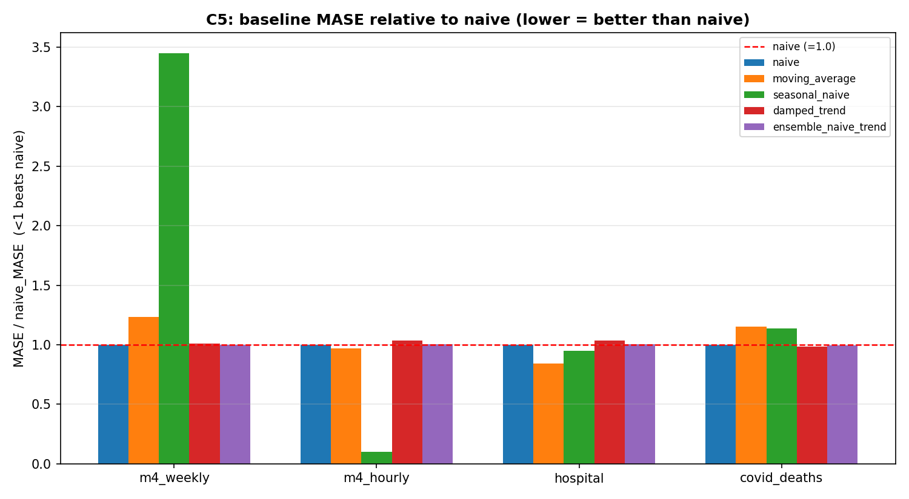
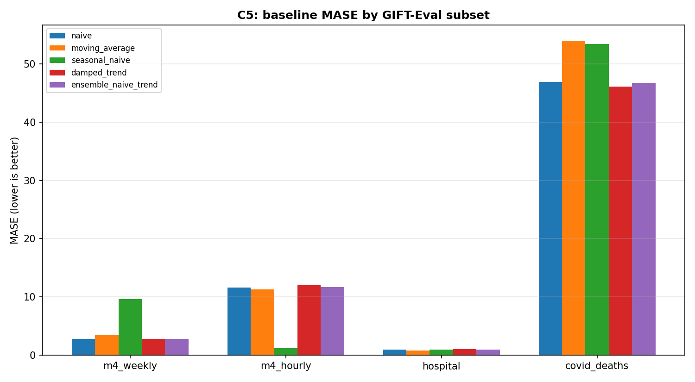

# C5 — GIFT-Eval Subset Scouting (DONE)

**Goal:** find 1–2 small GIFT-Eval subsets where the last-value **naive** baseline is *not*
dominant, so a future ERA search (C6) has real headroom to improve beyond naive. C3/C4 showed naive
is near-optimal on `m4_weekly/W/short`; C5 scouts cheaper alternatives.

**Scope:** cheap hand-written baselines only — **no Gemini, no ERA search, no best-of-N, no
foundation models, no full benchmark.** Scoring uses the same official gluonts pipeline as C2
(reward = -MASE, lower MASE is better).

## Environment (two-env rule)
The scout (`implementation/gift_eval_subset_scout.py`) imports gluonts/`gift_eval` via the C2 wrapper,
so it is run with the **GIFT-Eval venv**, not the ERA env:
```bash
cd /Users/zhangweikun/era/implementation
/Users/zhangweikun/era/gift-eval/.venv/bin/python -u gift_eval_subset_scout.py
```
Run in a normal terminal (GIFT-Eval native libs segfault under an agent sandbox).

## Datasets scouted (all small, fast; only these were downloaded — NOT the full benchmark)
| dataset | freq | pred_len | #series | size | why included |
|---|---|---:|---:|---:|---|
| `m4_weekly` | W | 13 | 359 | 1.5 MB (already had) | reference — near random walk |
| `m4_hourly` | H | 48 | 414 | 1.5 MB | strong daily seasonality (period 24) |
| `hospital` | M | 12 | 767 | 0.28 MB | monthly count data, seasonality 12 |
| `covid_deaths` | D | 30 | 266 | 0.23 MB | daily, strong trend |

Larger M4 families were **deliberately skipped** for runtime (`m4_daily` 40 MB/4227 series,
`m4_monthly` 46 MB/48k, `m4_quarterly` 10 MB/24k, `m4_yearly` 4 MB/23k).

## Baselines (C2 candidate interface)
`naive` (last value) · `moving_average` (mean of last 8) · `seasonal_naive` (tile last season; period
by freq H→24, D→7, W→52, M→12) · `damped_trend` (last + tiny capped damped slope) ·
`ensemble_naive_trend` (0.8·naive + 0.2·damped_trend).

## Results (MASE, lower is better; full data in `scout_results.csv` / `.json`)

| dataset | naive | moving_avg | seasonal_naive | damped_trend | ensemble | best non-naive | ratio* | recommendation |
|---|---:|---:|---:|---:|---:|---|---:|---|
| `m4_weekly` | **2.7773** | 3.4206 | 9.5780 | 2.8039 | 2.7818 | ensemble 2.7818 | 1.002 | ❌ naive dominates |
| `m4_hourly` | 11.6077 | 11.2784 | **1.1932** | 12.0371 | 11.6902 | seasonal_naive **1.1932** | **0.103** | ✅ **strong candidate** |
| `hospital` | 0.9676 | **0.8139** | 0.9205 | 1.0030 | 0.9744 | moving_average **0.8139** | **0.841** | ✅ **strong candidate** |
| `covid_deaths` | 46.9124 | 54.0025 | 53.4121 | **46.0975** | 46.7494 | damped_trend 46.0975 | 0.983 | 🟡 possible |

\* ratio = best-non-naive MASE / naive MASE; **< 1 means a simple method beats naive.**




## Interpretation
- **`m4_hourly` — the standout.** Seasonal naive (period 24) scores **1.19 vs naive 11.61** — almost
  **10× better**. Hourly electricity-style series are strongly daily-periodic, so naive is terrible
  and there is enormous headroom. Small (414 series) and fast (~0.18 s/baseline).
- **`hospital` — solid secondary.** Moving average **0.81 vs naive 0.97** (−16%), and seasonal naive
  (period 12) also beats naive. Monthly count data with seasonality + smoothing structure ERA can
  exploit. Small (767 series), fast.
- **`covid_deaths` — marginal.** Only `damped_trend` edges naive (46.10 vs 46.91, −1.7%); high
  absolute MASE and pandemic-driven instability make it a weak target.
- **`m4_weekly` — confirms C3/C4.** No simple method beats naive (best non-naive is 0.2% *worse*).
  This is why ERA could only tie naive there.

## Recommended C6 targets
1. **`m4_hourly/H/short`** (primary) — huge, unambiguous headroom (a simple seasonal method beats
   naive ~10×), strong/clear seasonal structure, small & fast, no install issues, stable metrics.
   ERA should comfortably beat naive here, and the interesting question becomes how well ERA refines
   seasonal/forecasting code.
2. **`hospital/M/short`** (secondary) — multiple simple methods beat naive, small & fast, different
   domain/frequency (monthly healthcare) for a second data point.

Both meet the C6 criteria: small enough to evaluate repeatedly, no install problems, naive is **not**
unbeatable, ≥1 simple non-naive baseline beats naive, and metrics are stable/interpretable.

## How to choose the next C6 target
Pick the subset with the **lowest ratio** (most headroom) that is still **small/fast and stable** —
here that is **`m4_hourly`**. Use `hospital` as a confirmatory second benchmark. Avoid `m4_weekly`
and `covid_deaths` for "beat naive" experiments (naive dominant / only marginal gains).

## Files
- `scout_results.csv` — one row per (subset, baseline) with MASE/CRPS/RMSE/reward/runtime/valid.
- `scout_results.json` — same rows + per-subset summaries (naive, best non-naive, ratio, recommendation).
- `baseline_mase_by_subset.png`, `relative_to_naive.png` — plots.
- `commands_used.sh`, `environment_info.txt`, `scout_run_output.txt`.
- Script: `implementation/gift_eval_subset_scout.py`.

## Status
**C5 complete and ready.** Clear recommendation for C6: **`m4_hourly`** (primary), **`hospital`**
(secondary). No Gemini/ERA/best-of-N were run; only cheap CPU baselines.
